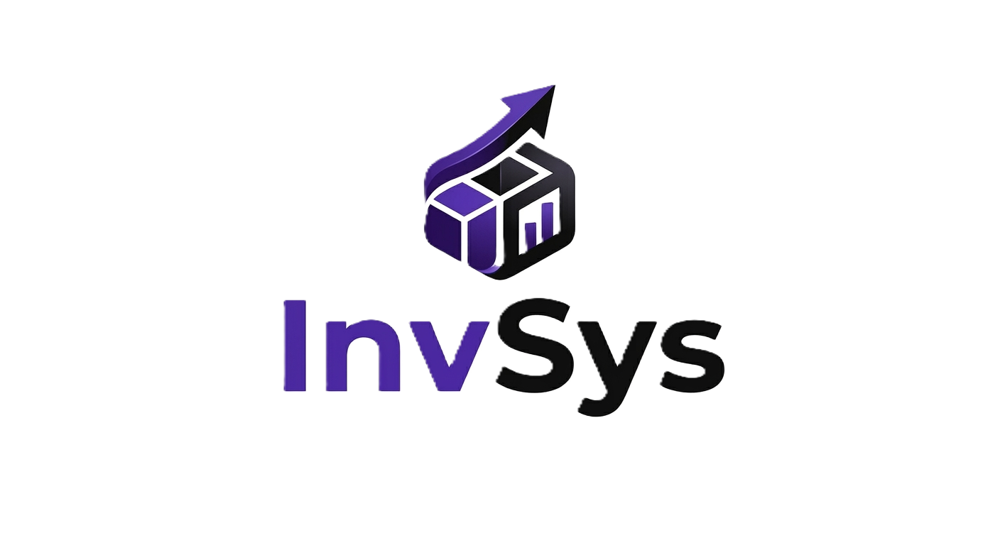

# 📦 InvSys WMS — Sistema Inteligente de Gestión de Inventarios y Almacenes

[](https://www.php.net/)
[](https://www.mysql.com/)
[](https://en.wikipedia.org/wiki/Model%E2%80%93view%E2%80%93controller)
[](https://getbootstrap.com/)
[](LICENSE)

<p align="center">
  
</p>

**InvSys WMS** (Warehouse Management System) es una plataforma de gestión de almacenes de nivel empresarial, de **código abierto (Open Source)** y alto rendimiento. Está construida sobre una arquitectura pura **Modelo-Vista-Controlador (MVC) en PHP 8.1+** sin la sobrecarga de frameworks externos pesados, lo que garantiza una velocidad de carga ultrarrápida (tiempos de respuesta inferiores a 50ms en servidor) y un control absoluto sobre el ciclo de vida de los inventarios.

Diseñado específicamente para empresas que exigen precisión quirúrgica, **InvSys WMS** resuelve pérdidas de stock, mermas por caducidad y la falta de trazabilidad en artículos de alto valor a través de flujos de trabajo blindados y control transaccional atómico.

---

## 🎯 Objetivos del Sistema

* **Trazabilidad Total**: Control absoluto del flujo de mercancías, desde su recepción y ubicación en estantes hasta su requisición y despacho departamental.
* **Consistencia de Datos**: Evitar condiciones de carrera y discrepancias de inventario mediante bloqueos transaccionales directos en base de datos (`SELECT ... FOR UPDATE`).
* **Operación Veloz**: Integración directa con lectores de códigos de barras (UPC/EAN) y cámaras de dispositivos móviles para agilizar los conteos y despachos.

---

## 🌟 Módulos del Sistema (23 Módulos Core)

El sistema está compuesto por 23 controladores especializados que gestionan el flujo completo del almacén:

| Módulo / Controlador | Descripción Operativa |
| :--- | :--- |
| 📊 **Dashboard** | Panel administrativo con analíticas en tiempo real, widgets financieros, alertas de stock mínimo y gráficos de rendimiento de movimientos. |
| 📦 **Productos** | Catálogo maestro de productos con soporte para SKU, control de stock mínimo, serialización, peso, volumen y selector de categorías. |
| 🏷️ **Categorías** | Organización taxonómica de productos con filtros inteligentes de estado activo/inactivo. |
| 🗺️ **Ubicaciones** | Mapa físico del almacén (Pasillos, Estantes, Niveles, Bahías) para saber exactamente dónde se encuentra cada lote. |
| 🔄 **Movimientos** | Entradas, salidas y ajustes manuales blindados con transacciones de base de datos e historial inmutable. |
| 📞 **WhatsApp (Notificaciones)** | Envío automatizado diario (Daily Digest) de alertas críticas al administrador mediante el servicio gratuito **CallMeBot**. |
| 📨 **Correo (Mail Service)** | Soporte dual para envío de notificaciones mediante `mail()` nativo de PHP o conexiones socket directas con cifrado **SMTP** (TLS/SSL). |
| 🔎 **Escáner Integrado** | Lector web nativo mediante cámara de celular/dispositivo para escanear y procesar códigos de barras (EAN/UPC) y códigos QR en tiempo real. |
| 📝 **Requisiciones** | Flujo completo de solicitud interna de materiales por parte de departamentos con estados de aprobación y despacho. |
| 🛒 **Órdenes de Compra** | Gestión de aprovisionamiento de stock con proveedores, control de precios de adquisición y generación de PDFs formales. |
| 🔄 **Devoluciones** | Módulo de logística inversa para procesar mercancías retornadas y reincorporarlas al stock de forma auditada. |
| 🏢 **Departamentos** | Gestión de centros de costo y departamentos de la empresa que solicitan insumos. |
| 👥 **Usuarios** | Administración de cuentas de usuario con roles de seguridad estrictos. |
| 🔐 **Seguridad y Logs** | Registro inmutable de acciones críticas del sistema (quién, cuándo y qué acción de base de datos se alteró) para auditoría interna. |
| 🔑 **Autenticación (Auth)** | Login seguro con protección contra ataques de fuerza bruta (Rate Limiting por IP) y control de intentos fallidos con bloqueo temporal. |
| 🤝 **Proveedores** | Catálogo de proveedores con información de contacto, términos de pago e histórico de compras. |
| 🗃️ **Respaldos (Backups)** | Generación, descarga y restauración segura de copias de seguridad de la base de datos SQL con protección contra inyección de rutas (Path Traversal). |
| 📊 **Reportería Avanzada** | Exportación de datos de inventario, mermas, y movimientos en formatos **PDF** y **CSV** con filtros por fechas. |
| 🎯 **Alertas del Sistema** | Monitoreo en tiempo real de niveles bajos de inventario y lotes próximos a vencer. |
| 📍 **Transferencias** | Control del movimiento de mercancía entre diferentes almacenes o ubicaciones internas. |
| 📋 **Conteo / Auditoría** | Planificación de conteos físicos y conciliación de stock para detectar fugas de mercancía. |
| 👤 **Perfil** | Gestión de credenciales personales de usuario (correo, contraseña, avatar). |
| 🎨 **Temas** | Conmutador de modo visual (Modo Oscuro / Modo Claro) para mejorar la visualización en entornos de almacén de poca iluminación. |

---

## 🔒 Arquitectura y Capa de Seguridad Hardened

**InvSys WMS** no compromete la seguridad. Cuenta con defensas integradas diseñadas bajo principios de ciberseguridad industrial:

* **Protección contra Inyección SQL**: El core del framework extiende un `Model` base con un validador estricto de identificadores mediante expresiones regulares (`validateIdentifier()`), impidiendo inyecciones incluso al concatenar dinámicamente nombres de columnas u órdenes de ordenamiento.
* **Seguridad Antihackeo en Archivos (Path Traversal)**: El gestor de respaldos (`BackupController`) cuenta con la función `isValidBackupFilename()` que solo permite descargar archivos con nombres exactos de marca de tiempo (`invsys_backup_YYYY-MM-DD.sql`), bloqueando caracteres de salto de directorio (`..`, `/`, `\`).
* **Protección CSRF Dinámica**: Cada formulario `POST` incluye un token criptográfico de un solo uso asociado a la sesión del usuario para evitar falsificaciones de peticiones en sitios cruzados.
* **Rate Limiting de Login**: Protección automática contra fuerza bruta; bloquea direcciones IP tras múltiples intentos erróneos durante un tiempo parametrizable.
* **Auditoría Inmutable**: Cualquier cambio en campos críticos (como existencias o precios) dispara un registro automático mediante `SecurityService::logAction()`, capturando IP, navegador, fecha y la consulta original.

---

## 🛠️ Tecnologías Utilizadas

### Backend Core
* **PHP >= 8.1** (Sin frameworks; programación orientada a objetos pura con autocargador de clases PSR-12).
* **MySQL >= 8.0 / MariaDB 10.4+** con motor transaccional `InnoDB`.

### Frontend & UX/UI
* **HTML5 / CSS3 / Vanilla JavaScript (ES6+)** (Cero dependencias pesadas de NPM).
* **Bootstrap v5.3** (Estilizado responsivo con densidades visuales optimizadas para pantallas de tablets industriales).
* **Old Input Flash-UX**: Sistema personalizado que retiene y rellena los datos ingresados al fallar una validación para evitar reescritura.

---

## 🚀 Instalación y Configuración Local

### 1. Clonar el repositorio
```bash
git clone https://github.com/tu-usuario/invsys.git
cd invsys
```

### 2. Instalar dependencias de desarrollo/reportes
```bash
composer install
```

### 3. Configurar Variables de Entorno (`.env`)
Duplica el archivo `.env.example` y renómbralo a `.env`. Ajusta tus datos locales:
```env
APP_ENV=development

DB_DRIVER=mysql
DB_HOST=localhost
DB_PORT=3306
DB_DATABASE=invsys_db
DB_USERNAME=root
DB_PASSWORD=
DB_CHARSET=utf8mb4

APP_BASE_URL=/invsys/public
```

### 4. Inicializar la Base de Datos
Importa la estructura inicial de tablas y semillas desde el archivo **`database/invsys.sql`** usando phpMyAdmin de tu servidor local (XAMPP/Laragon) o por consola:
```bash
mysql -u root -p invsys_db < database/invsys.sql
```

### 5. Correr las Migraciones
Ejecuta las migraciones dinámicas para inicializar los módulos de WhatsApp CallMeBot de forma local:
```bash
php database/migrations/fase11_whatsapp.php
php database/migrations/migrate_callmebot.php
```

### 6. Iniciar Servidor Local
Si usas XAMPP, coloca el proyecto dentro de `htdocs/invsys` y accede mediante `http://localhost/invsys/public`. También puedes usar el servidor integrado de PHP:
```bash
cd public
php -S localhost:8000
```

---

## 🌍 Despliegue a Hosting / Producción

Para subir el proyecto a un hosting compartido con cPanel o servidor VPS, he preparado una guía detallada paso a paso que cubre la carga de archivos, permisos CHMOD de escritura en logs y copias de seguridad, y la automatización diaria del script de alertas vía **Cron Jobs**.

👉 Consulta la **[Guía Completa de Despliegue en Hosting (GUIA_DESPLIEGUE.md)](file:///c:/xampp/htdocs/invsys/GUIA_DESPLIEGUE.md)**.

---

## 📈 Estructura de Directorios

```text
├── /app
│   ├── /Controllers       # Controladores del MVC
│   ├── /Models            # Modelos e interactores de BD (ActiveRecord)
│   ├── /Views             # Vistas del frontend (HTML/PHP)
│   ├── /core              # Núcleo MVC (Router, Modelo base, Carga de Entornos)
│   ├── /services          # Servicios desacoplados (Alertas, Correo, Logs)
│   └── /helpers           # Funciones de ayuda global (urls, formatos, auth)
├── /config                # Configuración de base de datos
├── /database              # Esquema SQL y migraciones
├── /public                # Carpeta pública (Assets: JS, CSS, Imágenes) e index.php
├── /routes                # Enrutador del sistema (web.php)
├── /scripts               # Scripts CLI automatizables (cron_alertas.php)
├── /storage               # Almacenamiento de Backups y Logs
└── .env                   # Variables de entorno (Ignorado en Git)
```

---

## 👨‍💻 Autor y Licencia

Desarrollado y diseñado con precisión por **Josué Lopez** (*Programador JR. / Arquitectura de Sistemas Web*).

Este software es de **código abierto** y se distribuye bajo la licencia **MIT**. Eres libre de usarlo, modificarlo y adaptarlo a las necesidades críticas de tu negocio.
